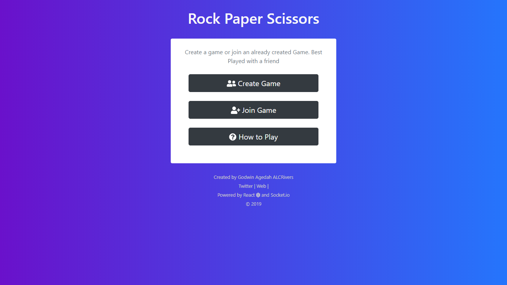
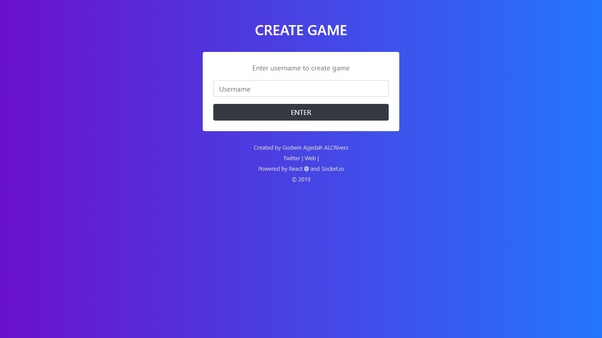
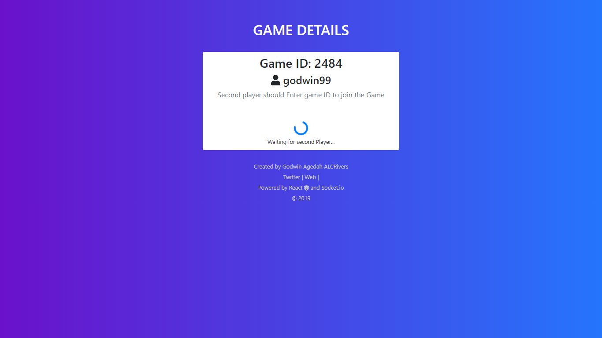
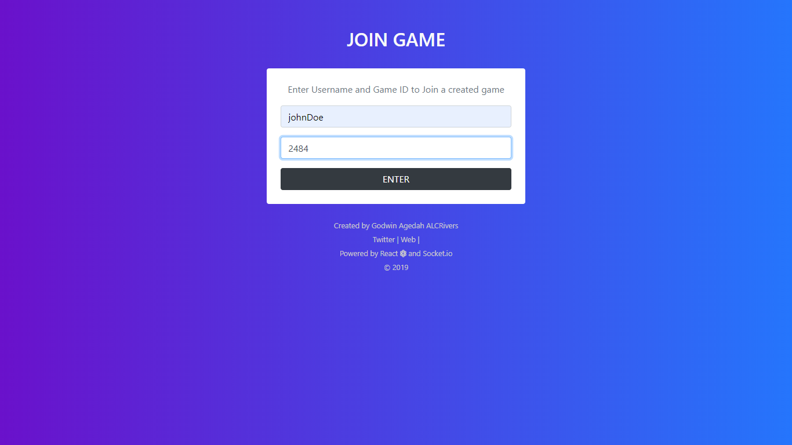
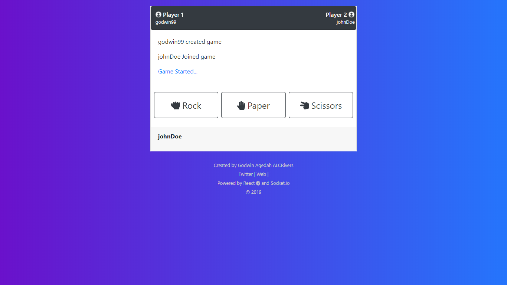
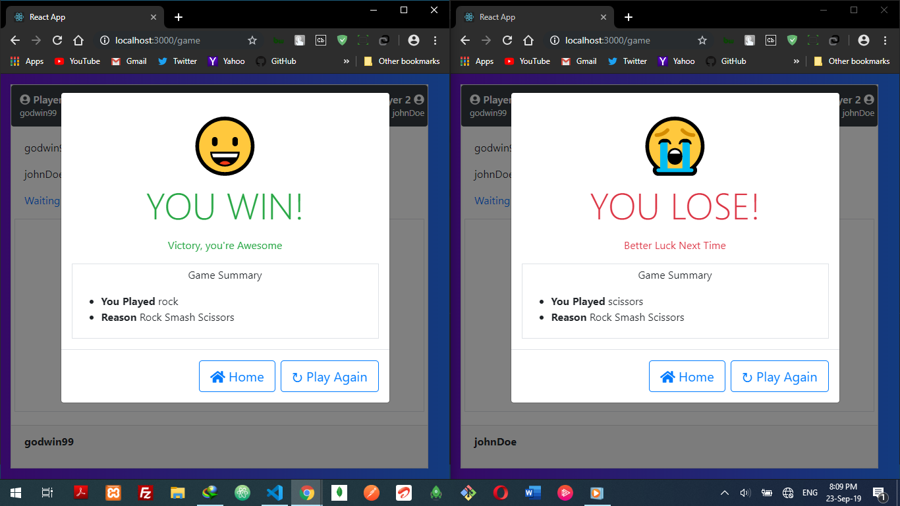
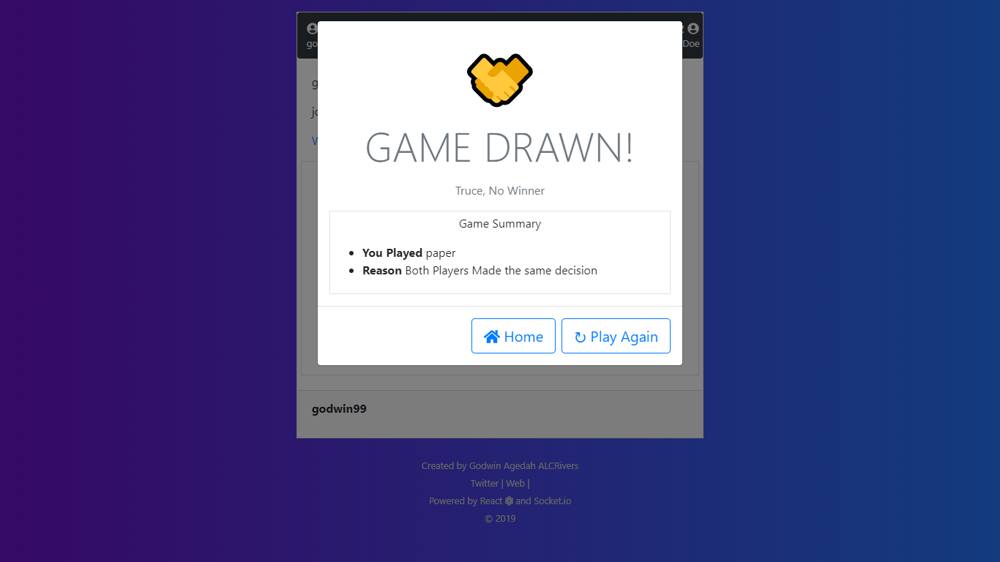

# rock-paper-scissors
A Mutliplayer Rock Paper Scissors game using React and Socket.io

## Frontend

* React and Bootstrap. 

* Reactstrap components was used for the modals and loading spinners.

* React Animations an animation library based on animate.css

### Select Screen

A user can create a new game, join an already created game or learn how to play.

### Create Game
Player one creates Game

Player one waits for second player to join via gameID

### Join Game
Player two joins Game with gameid

### Game
Players make a choices by clicking the Buttons they wish to play.

## Backend

* The Backend is Powered by Socket.io running on express.

* Database is Nedb, lightweight database built with mongodb API

